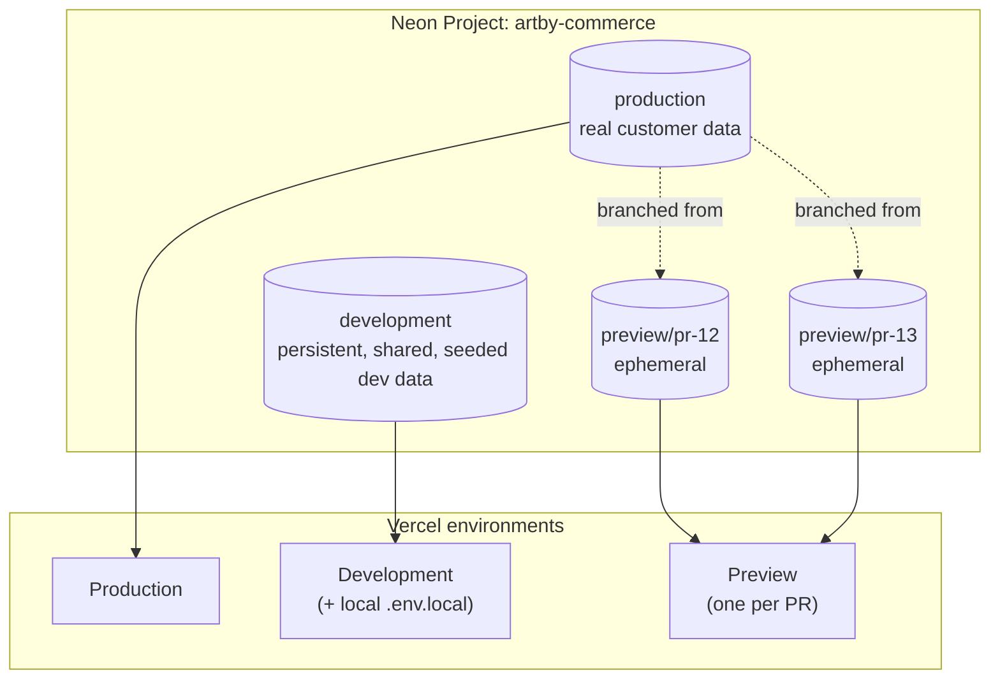
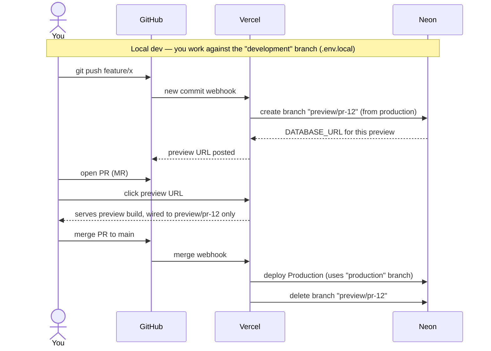

# Neon + Vercel branching strategy

How database branches map to environments, and what happens to data isolation
as code moves from a local feature branch through a PR/preview to `main`.

## 1. Branch topology

Three tiers, three purposes: `production` is sacred, `development` is the
everyday shared sandbox, and `preview/*` branches are throwaway and scoped to
a single PR's lifetime.

## 2. Lifecycle: dev → PR → preview → merge

Key points:

- Every PR gets its own isolated copy of the data (schema + snapshot), so a
  reviewer testing destructive changes on a preview can't corrupt prod or the
  shared dev branch.
- The preview branch is deleted automatically the moment Vercel tears down
  that preview deployment (PR closed or merged) — no manual cleanup, no
  orphaned branches piling up in the Neon dashboard.
- Production is only ever touched by the Production deployment, never by a
  preview build.

## 3. Open question: migrations

Neither integration runs `drizzle-kit migrate` for you — that's still
something to trigger explicitly. Two common approaches:

- Run it as part of the Vercel build command for that environment (e.g.
  `pnpm db:migrate && next build`), so each preview build migrates its own
  fresh branch, and the production build migrates the production branch on
  deploy.
- Run it as a separate CI step (GitHub Actions) before/alongside the Vercel
  deploy.

Wiring it into the build command is probably the least-friction option given
migrations are already run manually via `pnpm db:migrate`, but a botched
migration in a build step blocks deploys — worth deciding deliberately rather
than defaulting into it.

## 4. How the existing test harness fits in

Unrelated to all of the above — `test/setup/global-setup.ts`'s ephemeral
branch-per-test-run is a separate, third lifecycle purely for `pnpm test`
(local or CI), independent of Vercel previews. Nothing needs to change there.
